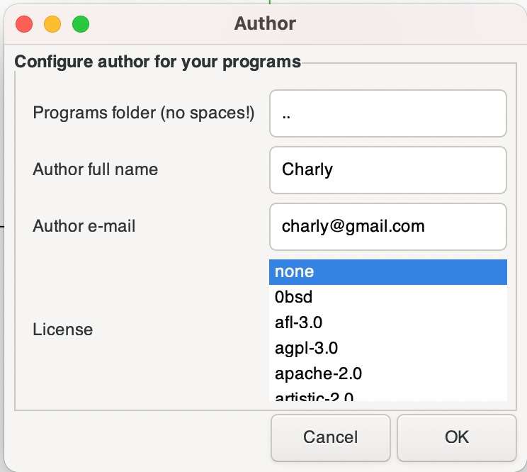

                                                    


# PIDS

Repo limpio para el proyecto PIDS de la CESE 2020

[TOC]

TO DO:--> ver ejemplo interrupciones UART

## Iniciar Repositorio

Para ejecutar el software desarrollado en este repositorio hace falta incluir submódulos y también software adicional relacionado a la plataforma EDU-CIAA. Para esto, se explican los pasos:

1. Clonar este repositorio
2. Incluir submódulos
3. Instalar software

### 1: Clonar este repositorio

```bash
git clone https://github.com/charlieromano/PIDS.git
```

### 2: Incluir submódulos

```bash
cd PIDS
git submodule add https://github.com/epernia/firmware_v3.git    #Agrega firmware_v3 como submodulo
```

### 3: Instalar software

Si tiene todo el software instalado puede saltar a la sección siguiente de Crear un Programa.


#### 3.1 Instalar openocd

```bash
sudo apt install openocd
```

#### 3.2 Instalar gcc-arm-none-eabi

Este fue el primer fail al intentar compilar un programa con el comando "make download". Para solucionarlo, en la instalación de ubuntu 20 LTS lo que hice fue seguir el siguiente hilo: https://askubuntu.com/questions/1243252/how-to-install-arm-none-eabi-gdb-on-ubuntu-20-04-lts-focal-fossa

Básicamente hice lo siguiente:

```bash
sudo apt remove gcc-arm-none-eabi
```

Download latest version  (Linux x86_64 Tarball) [from their website](https://developer.arm.com/tools-and-software/open-source-software/developer-tools/gnu-toolchain/gnu-rm/downloads), check its MD5. Unpack it into some directory. I used /usr/share/ : 

```bash
sudo tar xjf gcc-arm-none-eabi-your-version.bz2 -C /usr/share/
```

Create links so that binaries are accessible system-wide:

```bash
sudo ln -s /usr/share/<gcc-arm-none-eabi-your-version>/bin/arm-none-eabi-gcc /usr/bin/arm-none-eabi-gcc 
...
```

Para mi instalación, (ubuntu 20 LTS) tuve que ejecutar los siguientes links:

```bash
/usr/share$ sudo ln -s /usr/share/gcc-arm-none-eabi-10-2020-q4-major-x86_64-linux/gcc-arm-none-eabi-10-2020-q4-major/bin/arm-none-eabi-gcc /usr/bin/arm-none-eabi-gcc
/usr/share$ sudo ln -s /usr/share/gcc-arm-none-eabi-10-2020-q4-major-x86_64-linux/gcc-arm-none-eabi-10-2020-q4-major/bin/arm-none-eabi-g++ /usr/bin/arm-none-eabi-g++
/usr/share$ sudo ln -s /usr/share/gcc-arm-none-eabi-10-2020-q4-major-x86_64-linux/gcc-arm-none-eabi-10-2020-q4-major/bin/arm-none-eabi-gdb /usr/bin/arm-none-eabi-gdb
/usr/share$ sudo ln -s /usr/share/gcc-arm-none-eabi-10-2020-q4-major-x86_64-linux/gcc-arm-none-eabi-10-2020-q4-major/bin/arm-none-eabi-size /usr/bin/arm-none-eabi-size
/usr/share$ sudo ln -s /usr/share/gcc-arm-none-eabi-10-2020-q4-major-x86_64-linux/gcc-arm-none-eabi-10-2020-q4-major/bin/arm-none-eabi-objcopy /usr/bin/arm-none-eabi-objcopy
/usr/share$ sudo ln -s /usr/share/gcc-arm-none-eabi-10-2020-q4-major-x86_64-linux/gcc-arm-none-eabi-10-2020-q4-major/bin/arm-none-eabi-objdump /usr/bin/arm-none-eabi-objdump

```

Luego funcionó ok.

#### 3.3 	Instalar software EDU-CIAA (opcional)

Debe descargar de [releases](https://github.com/epernia/software/releases/tag/r1.1.0) la versión para Windows o Linux.

Link: https://github.com/epernia/software/releases/tag/r1.1.0

Descomprimir la carpeta en una ruta conocida, sin espacios y con los permisos adecuados. Se recomiendan:

- **Windows**. C:\CIAA\
- **Linux**. $HOME/CIAA/

Luego ingresar a la carpeta y ejecutar el lanzador de apliaciones. 


## Crear un programa

Ir al directorio del repositorio, y luego desde el submodule firmware_v3 crear un program folder:

```bash
cd PIDS
cd firmware_v3          #Entras al repo del firmware_v3
make new_program        #Ejecutas el script para crear nuevo programa
```

Se debe abrir un cuadro de diálogo como el siguiente:



```bash
PIDS/firmware_v3$ make new_program 
  ../ISR_test/out/../ISR_test/src/ISR_test.o ../ISR_test/out/libs/cmsis_core//src/armv7m_startup.o ../ISR_test/out/libs/editline//src/editline.o ../ISR_test/out/libs/sys_newlib//src/system.o  

User preferences found in file: /home/charlieromano/Documents/Academico/CESE/PIDS/firmware_v3/scripts/user/user_preferences.cfg
 - Programs folder: ..
 - Author full name: Ing. Carlos German Carreño Romano
 - Author e-mail: ccarreno@fi.uba.ar
 - License: bsd-2-clause

New program wizard starting...

Program created on folder: ..
 - Name: ISR_test
 - Version: 1.0
 - Template: c
Selected as program to compile in program.mk
```


Luego se puede chequear el árbol del proyecto, en este caso el proyecto se llama ISR_test:

```bash
CESE/PIDS/firmware_v3$ tree -L 2 ../ISR_test/
../ISR_test/
├── config.mk
├── inc
│   └── ISR_test.h
├── ISR_test
│   └── src
├── LICENSE.txt
├── out
│   ├── ISR_test.bin
│   ├── ISR_test.elf
│   ├── ISR_test.map
│   ├── libs
│   └── linker-params
└── src
    └── ISR_test.c

6 directories, 8 files
```

Con este programa se puede compilar y descargar a la placa con make download:

```bash
CESE/PIDS/firmware_v3$ make download 
  ../ISR_test/out/../ISR_test/src/ISR_test.o ../ISR_test/out/libs/cmsis_core//src/armv7m_startup.o ../ISR_test/out/libs/editline//src/editline.o ../ISR_test/out/libs/sys_newlib//src/system.o  
CC ISR_test.c
LD params
LD ../ISR_test/out/ISR_test.elf...
COPY ISR_test.elf TO ISR_test.bin
DOWNLOAD to FLASH
Open On-Chip Debugger 0.10.0
Licensed under GNU GPL v2
For bug reports, read
	http://openocd.org/doc/doxygen/bugs.html
dap command not exists. Use OLD script
adapter speed: 2000 kHz
none separate
cortex_m reset_config vectreset
Info : clock speed 2000 kHz
Info : JTAG tap: lpc4337.m4 tap/device found: 0x4ba00477 (mfg: 0x23b (ARM Ltd.), part: 0xba00, ver: 0x4)
Info : JTAG tap: lpc4337.m0 tap/device found: 0x0ba01477 (mfg: 0x23b (ARM Ltd.), part: 0xba01, ver: 0x0)
Info : lpc4337.m4: hardware has 6 breakpoints, 4 watchpoints
Info : lpc4337.m0: hardware has 2 breakpoints, 1 watchpoints
auto erase enabled
wrote 8192 bytes from file ../ISR_test/out/ISR_test.bin in 0.350298s (22.838 KiB/s)
Info : JTAG tap: lpc4337.m4 tap/device found: 0x4ba00477 (mfg: 0x23b (ARM Ltd.), part: 0xba00, ver: 0x4)
Info : JTAG tap: lpc4337.m0 tap/device found: 0x0ba01477 (mfg: 0x23b (ARM Ltd.), part: 0xba01, ver: 0x0)
Warn : Only resetting the Cortex-M core, use a reset-init event handler to reset any peripherals or configure hardware srst support.
Warn : Only resetting the Cortex-M core, use a reset-init event handler to reset any peripherals or configure hardware srst support.
shutdown command invoked

```

