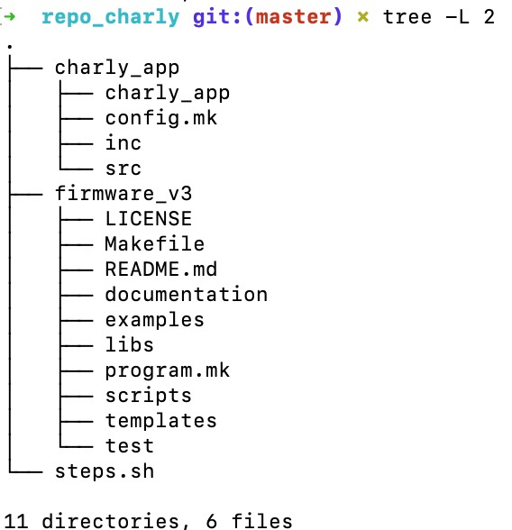

                                                    


# PIDS

Repo limpio para el proyecto PIDS de la CESE 2020


## Iniciar Repositorio

Para ejecutar el software desarrollado en este repositorio hace falta incluir submódulos y también software adicional relacionado a la plataforma EDU-CIAA. Para esto, se explican los pasos:

1. Clonar este repo
2. Incluir submódulos
3. Instalar software


### Incluir submódulos

```bash
mkdir repo_charly       #Creas la carpeta que vas a subir a GitHub
cd repo_charly          #Entras a la carpeta
mkdir charly_app        #Creas la carpeta para tu proyecto
git init                #Creas un nuevo repositorio
git submodule add https://github.com/epernia/firmware_v3.git    #Agregas firmware_v3 como submodulo
cd firmware_v3          #Entras al repo del firmware_v3
make new_program        #Ejecutas el script para crear nuevo programa

```


## Crear un programa


Chequear el árbol del proyecto:

