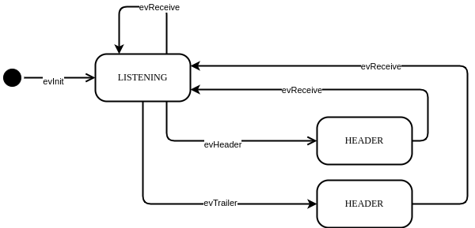
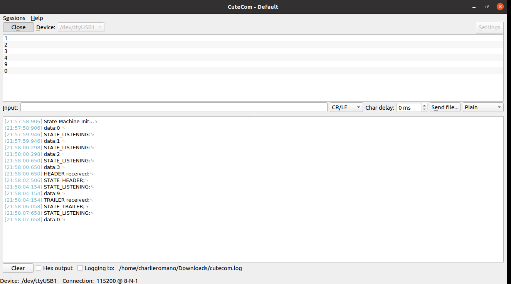
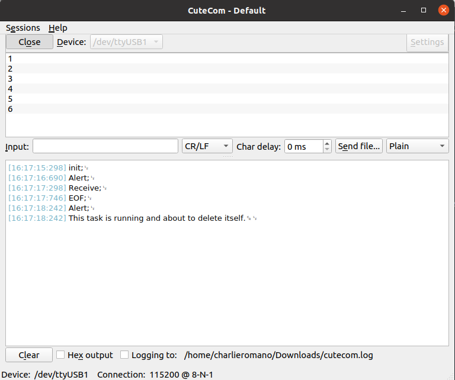

# State Machine and Active Object

[1. Finite State Machine (fsm)](#fsm)

[2. Finite State Machine con RTOS](#fsmRTOS)

[3. Ejemplo de Objetos Activos con máquinas de estado en RTOS](#activeObjectRTOS)


## 1.  Finite State Machine (fsm) <a name="fsm"></a>

**Ejemplo de máquina de estados usando un arreglo de estructuras **


En este ejemplo se implementa una máquina de estados sencilla que contiene tres estados:

* STATE_LISTENING
* STATE_HEADER
* STATE_TRAILER

El ejemplo está implementado en C usando RTOS y tiene como fin implementar progresivamente un diseño de máquina de estados para procesamiento de tramas de red TCN.

La máquina de estados inicial se detalla en el siguiente diagrama:





Las definiciones de estados, eventos, estructura y handlers se muestra en el código a continuación. Observar que con esta estructura simple y transparente al diseño se logra escala, legibilidad y mantenibilidad. El uso o cambio de  handlers queda explícito por fuera del funcionamiento de la máquina de estados. Este tipo de implementación requiere el diseño previo de la máquina, especificando como se puede ver en el diagrama todo el funcionamiento de la máquina, incluyendo estados y eventos.

```C
//statemachineTCN.h
#ifndef STATEMACHINE_H
#define STATEMACHINE_H

#include "sapi.h"
#include "board.h"
#include 	<stdio.h>

#define  	HEADER 		'3'
#define  	TRAILER 	'9'


typedef enum {
	STATE_INIT,
	STATE_LISTENING,
	STATE_HEADER,
	STATE_TRAILER
} eSystemState;

typedef enum{
	evInit,
	evReceive,
	evHeader,
	evTrailer
} eSystemEvent;

typedef eSystemState (*pfEventHandler)(void);

typedef struct{
	eSystemState 		fsmState;
	eSystemEvent 		fsmEvent;
	pfEventHandler 		fsmHandler;
} sStateMachine;

eSystemState 	InitHandler(void)		;
eSystemState 	ListeningHandler(void)	;
eSystemState 	HeaderHandler(void)		;
eSystemState 	TrailerHandler(void) 	;


#endif

```

Luego la ejecución del código principal resulta en una iteración muy sencilla que actualiza el estado de la máquina de estados según el evento de entrada y direccionando el handler que corresponda según el diseño. En este caso de estudio hay una sola salida por cada estado posible.

```c
//statemachineTCN.c
//statemachine.c
#include "statemachine.h"

extern uint8_t data;

eSystemState 	InitHandler(void){ 
	printf("State Machine Init...\n");
	printf("data:%c \n",data);
	return STATE_LISTENING; 
}

eSystemState 	ListeningHandler(void){ 
	//vcccccccc vb
	printf("STATE_LISTENING:\n");
	printf("data:%c \n",data);
	if(data==HEADER){
		printf("HEADER received:\n");
		return STATE_HEADER;
	}
	else if(data==TRAILER){
		printf("TRAILER received:\n");
		return STATE_TRAILER;
	}
	else
	{
		return STATE_LISTENING; 
	}
}

eSystemState 	HeaderHandler(void){
	printf("STATE_HEADER;\n");
	return STATE_LISTENING; 
}
eSystemState 	TrailerHandler(void){ 
	printf("STATE_TRAILER;\n");
	return STATE_LISTENING; 
}

sStateMachine fsmTest [] = 
{
	{STATE_INIT, evInit, InitHandler},
	{STATE_LISTENING, evReceive, ListeningHandler},
	{STATE_LISTENING, evHeader, HeaderHandler},
	{STATE_LISTENING, evTrailer, TrailerHandler},
	{STATE_HEADER, evReceive, ListeningHandler},
	{STATE_TRAILER, evReceive, ListeningHandler}
};

```


```c
//tasks.c
#include "tasks.h"		//Api de control de tareas y temporización

extern uint8_t data;
extern sStateMachine fsmTest[];
extern xTaskHandle xTaskStateMachineHandler;

void vTaskStateMachine(void *pvParameters)
{
	portTickType xLastWakeTime;
	xLastWakeTime = xTaskGetTickCount();

	eSystemState nextState = STATE_INIT;
	eSystemEvent newEvent;
	int i=0;

	while(1){
		while(i<20){

			if(uartReadByte( UART_USB, &data ))
			{
				if( (data!= '\n') && (data != '\r' ) )
				{
					newEvent=evReceive;
					fsmTest[nextState].fsmEvent == newEvent;
					nextState = (*fsmTest[nextState].fsmHandler)();
					i++;
				}
			}
			else
			{
				//printf("no condition\n;");
				vTaskDelayUntil(&xLastWakeTime, (50/portTICK_RATE_MS));
			}
		}
		vPrintString("This task is running and about to delete itself.\r\n");
		vTaskDelete(xTaskStateMachineHandler);
	}
}


void vTaskEchoUART(void* pvParameters){
   // Si recibe un byte de la UART_USB lo guardo en la variable dato.
   // Se reenvia el dato a la UART_USB realizando un eco de lo que llega
	while(1){
      if(  uartReadByte( UART_USB, &data ) ){
         uartWriteByte( UART_USB, data );
      }		
	}
}

```

```c
/*****************************************************************************
 * Copyright (c) 2021, Carlos Germán Carreño Romano <charlieromano@gmail.com>
 * All rights reserved.
 * License: gpl-3.0 (see LICENSE.txt)
 * Date: 2022/02/06
 * Version: 1.0
 ****************************************************************************/

#include "main.h"


DEBUG_PRINT_ENABLE;
uint8_t data  = 0; //variable global

xTaskHandle xTaskStateMachineHandler;

int main(void)
{

   boardConfig();
   debugPrintConfigUart( UART_USB, 115200 );

   if( xTaskCreate( vTaskStateMachine, "State Machine test", 
      configMINIMAL_STACK_SIZE*2, NULL, tskIDLE_PRIORITY+1, &xTaskStateMachineHandler) 
      == pdFAIL ) {
      perror("Error creating task");
      return 1;
   }

   vTaskStartScheduler();   // Scheduler

   while(1);

   return 0;
}

```




## 2. Finite State Machine con RTOS <a name="fsmRTOS"></a>

**Ejemplo de máquina de estados usando un arreglo de estructuras con RTOS**

En este ejemplo se implementa en RTOS la máquina de estados diseñada en el apartado anterior. Esta máquina de tres estados queda embebida en una tarea del sistema operativo y a modo de ejemplo se actualiza sólo cinco veces para luego ser eliminada. Una vez que la máquina deja de actualizarse por haberse eliminado la tarea que la maneja, el sistema operativo pasa a estado idle. Notar que para esta tarea se ha configurado el stack con el doble de tamaño que lo usual. Esto es debido a errores de Application Stack Overflow observados durante el desarrollo. 

Usando la misma estrategia de abstracción para la definición de la máquina de estados como array de estructuras y sus handlers asociados, la estructura de la aplicación resulta como se muestra en el siguiente arbol de archivos:

```bash
RTOS_fsm
├── config.mk
├── inc
│   ├── FreeRTOSConfig.h
│   ├── main.h
│   ├── statemachine.h
│   ├── tasks.h
│   └── udf.h
├── LICENSE.txt
├── out
│   ├── libs
│   ├── linker-params
│   ├── RTOS_fsm.bin
│   ├── RTOS_fsm.elf
│   └── RTOS_fsm.map
├── README.md
├── RTOS_fsm
│   └── src
└── src
    ├── main.c
    ├── statemachine.c
    ├── tasks.c
    └── udf.c
```
Observar que el directorio de los include tiene ahora la definición de la máquina de estados como un header y el directorio src contiene su implementación. De esta forma se logra mantenibilidad y se puede cambiar la implementación de los handlers de forma independiente. Las tareas ahora van a tener que incluir estas definiciones de máquinas de estado. 

El archivo principal (main.c) sigue resultando compacto, se define un handler de la tarea que contiene la máquina de estados para luego referenciar la tarea de forma externa:


```C
//main.c
#include "main.h"


DEBUG_PRINT_ENABLE;
uint8_t dato  = 0; //variable global

xTaskHandle xTaskStateMachineHandler; //Handler para eliminar la tarea

int main(void)
{

   boardConfig();
   debugPrintConfigUart( UART_USB, 115200 );

   if( xTaskCreate( vTaskStateMachine, "State Machine test", 
      configMINIMAL_STACK_SIZE*2, NULL, tskIDLE_PRIORITY+1, &xTaskStateMachineHandler) 
      == pdFAIL ) {
      perror("Error creating task");
      return 1;
   }

   vTaskStartScheduler();   // Scheduler

   while(1);

   return 0;
}
```
El archivo de tareas contiene la inicialización de la máquina de estados y la actualización de la misma usando la estrategia de arreglo de estructuras con punteros a función. Observar que la tarea pasa a estado bloqueado cada 50 milisegundos, y pasadas las cinco ejecuciones se elimina la tarea.

```C
//tasks.c
#include "tasks.h"		//Api de control de tareas y temporización

extern uint8_t dato;
extern sStateMachine fsmTest[];
extern xTaskHandle xTaskStateMachineHandler;

void vTaskStateMachine(void *pvParameters)
{
	portTickType xLastWakeTime;
	xLastWakeTime = xTaskGetTickCount();

	eSystemState nextState = STATE_INIT;
	eSystemEvent newEvent;
	int i=0;

	while(1){
		while(i<5){ //ejecuto cinco veces la actualización de la máquina de estados

			if(uartReadByte( UART_USB, &dato ))
			{
				if( (dato!= '\n') && (dato != '\r' ) )
				{
					newEvent++;
					fsmTest[nextState].fsmEvent == newEvent;
					nextState = (*fsmTest[nextState].fsmHandler)();
					i++;
				}
			}
			else //si no hay nada para leer, paso a estado blocked por un tiempo de 50 ms
			{
				vTaskDelayUntil(&xLastWakeTime, (50/portTICK_RATE_MS));
			}
		}
		//Pasadas cinco ejecuciones o cambios de estado, elimino la tarea StateMachine.
		vPrintString("This task is running and about to delete itself.\r\n");
		vTaskDelete(xTaskStateMachineHandler);
	}
}

```
El resultado de la ejecución se muestra a continuación. Observar que se ingresan sucesivamente los valores 1, 2, 3, 4, 5 y 6 y en este último la tarea ya ha sido eliminado, por lo que no se observa respuesta ya que el sistema quedó en estado IDLE.



Por completitud y dado que hay leves modificaciones respecto del ejemplo anterior, se muestran los archivos que corresponden a la definición de la máquina de estados.


```C
//statemachine.h
#ifndef STATEMACHINE_H
#define STATEMACHINE_H

#include "sapi.h"
#include "board.h"


#include 	<stdio.h>

typedef enum {
	STATE_INIT,
	STATE_A,
	STATE_B,
	STATE_C
} eSystemState;

typedef enum{
	evInit,
	evAlert,
	evReceive,
	evEOF
} eSystemEvent;

typedef eSystemState (*pfEventHandler)(void);

typedef struct{
	eSystemState 		fsmState;
	eSystemEvent 		fsmEvent;
	pfEventHandler 		fsmHandler;
} sStateMachine;

eSystemState 	InitHandler(void)	;
eSystemState 	AlertHandler(void)	;
eSystemState 	ReceiveHandler(void);
eSystemState 	EOFHandler(void) 	;


#endif

```

```C
//statemachine.c
#include "statemachine.h"


eSystemState 	InitHandler(void)	{ printf("init;\n");return STATE_A; }
eSystemState 	AlertHandler(void)	{ printf("Alert;\n");return STATE_B; }
eSystemState 	ReceiveHandler(void){ printf("Receive;\n");return STATE_C; }
eSystemState 	EOFHandler(void) 	{ printf("EOF;\n");return STATE_A; }

sStateMachine fsmTest [] = 
{
	{STATE_INIT, evInit, InitHandler},
	{STATE_A, evAlert, AlertHandler},
	{STATE_B, evReceive, ReceiveHandler},
	{STATE_C, evEOF, EOFHandler}
};
```

## 3. Active Object in RTOS <a name="activeObjectRTOS"></a>

**Ejemplo de Objetos Activos con máquinas de estado en RTOS [2]**

[2] Ref: https://www.sinelabore.de/doku.php/wiki/howto/rtos

