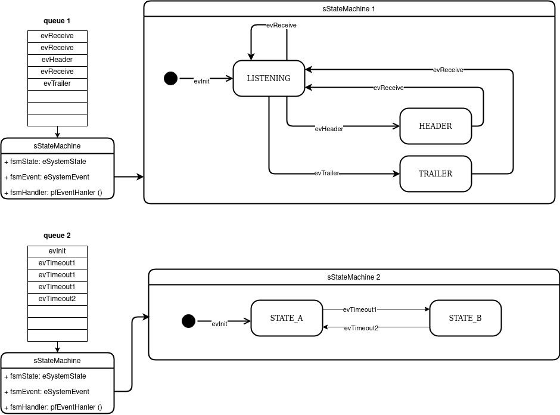
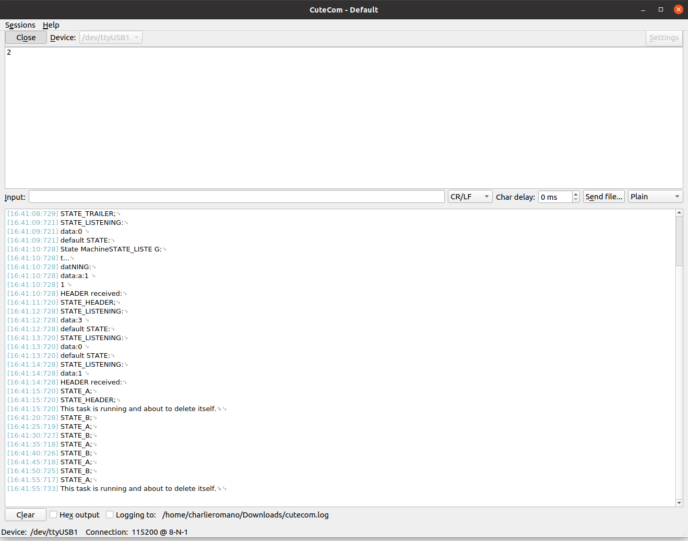

# State Machine and Active Object

[1. Ejemplo de Objetos Activos con máquinas de estado en RTOS](#activeObjectRTOS)


## 1.  Ejemplo de Objetos Activos con máquinas de estado en RTOS <a name="activeObjectRTOS"></a>

**Ejemplo de máquina de estados usando un arreglo de estructuras **


En este ejemplo se implementa una máquina de estados sencilla que contiene tres estados:

* STATE_LISTENING
* STATE_HEADER
* STATE_TRAILER

y una segunda máquina de estados de solamente dos estados:

* STATE_A
* STATE_B

El ejemplo está implementado en C usando RTOS y tiene como fin implementar progresivamente un diseño de máquina de estados para procesamiento de tramas de red TCN. En este ejercicio se combinan dos máquinas de estado usando la misma estructura funcional y el patrón de objeto activo. Se definen dos timers y dos colas, cada timer envía eventos a las respectivas colas y estas invocan métodos de callback que son ejecutados por las máquinas de estado. La invocación de los eventos queda desacoplada de la ejecución, usando para esto las colas queue_1 y queue_2.

La máquina de estados inicial se detalla en el siguiente diagrama:





Las definiciones de estados, eventos, estructura y handlers se muestra en el código a continuación. Observar que con esta estructura simple y transparente al diseño se logra escala, legibilidad y mantenibilidad. El uso o cambio de  handlers queda explícito por fuera del funcionamiento de la máquina de estados. Este tipo de implementación requiere el diseño previo de la máquina, especificando como se puede ver en el diagrama todo el funcionamiento de la máquina, incluyendo estados y eventos.

```C
#ifndef STATEMACHINE_H
#define STATEMACHINE_H

#include "sapi.h"
#include "board.h"
#include <stdio.h>

#define  	HEADER 		1
#define  	TRAILER 	2

extern uint8_t data;

typedef enum {
	STATE_INIT,
	STATE_LISTENING,
	STATE_HEADER,
	STATE_TRAILER
} eSystemState;

typedef enum{
	evInit,
	evReceive,
	evHeader,
	evTrailer
} eSystemEvent;

typedef eSystemState (*pfEventHandler)(void);

typedef struct{
	eSystemState 		fsmState;
	eSystemEvent 		fsmEvent;
	pfEventHandler 		fsmHandler;
} sStateMachine;

eSystemState 	InitHandler(void)		;
eSystemState 	ListeningHandler(void)	;
eSystemState 	HeaderHandler(void)		;
eSystemState 	TrailerHandler(void) 	;


#endif


//statemachine.c
#include "statemachine.h"

eSystemState 	InitHandler(void){ 
	printf("State Machine Init...\n");
	printf("data:%d \n",data);
	return STATE_LISTENING; 
}

eSystemState 	ListeningHandler(void){ 

	printf("STATE_LISTENING:\n");
	printf("data:%d \n", data);
	if(data==HEADER){
		printf("HEADER received:\n");
		return STATE_HEADER;
	}
	else if(data==TRAILER){
		printf("TRAILER received:\n");
		return STATE_TRAILER;
	}
	else
	{
		printf("default STATE:\n");
		return STATE_LISTENING; 
	}
}

eSystemState 	HeaderHandler(void){
	printf("STATE_HEADER;\n");
	return STATE_LISTENING; 
}
eSystemState 	TrailerHandler(void){ 
	printf("STATE_TRAILER;\n");
	return STATE_LISTENING; 
}

sStateMachine fsmTest [] = 
{
	{STATE_INIT, evInit, InitHandler},
	{STATE_LISTENING, evReceive, ListeningHandler},
	{STATE_HEADER, evReceive, HeaderHandler},
	{STATE_TRAILER, evReceive, TrailerHandler}
};


```
La segunda máquina de estados se presenta en el fragmento de código a continuación:

```c
#ifndef STATEMACHINE_B_H
#define STATEMACHINE_B_H

#include "sapi.h"
#include "board.h"
#include <stdio.h>

extern uint8_t data;

typedef enum {
	STATE_INIT_B,
	STATE_A,
	STATE_B
} eSystemState_B;

typedef enum{
	evInit_B,
	evTimeout1,
	evTimeout2
} eSystemEvent_B;

typedef eSystemState_B (*pfEventHandler_B)(void);

typedef struct{
	eSystemState_B 		fsmState;
	eSystemEvent_B 		fsmEvent;
	pfEventHandler_B	fsmHandler;
} sStateMachine_B;

eSystemState_B 	InitHandler_B(void);
eSystemState_B 	AtoBHandler(void);
eSystemState_B 	BtoAHandler(void);


#endif


//statemachine_B.c
#include "statemachine_B.h"

eSystemState_B 	InitHandler_B(void){ 
	printf("State Machine Init...\n");
	printf("data:%d \n",data);
	return STATE_A; 
}

eSystemState_B 	AtoBHandler(void){
	printf("STATE_A;\n");
	return STATE_B; 
}
eSystemState_B 	BtoAHandler(void){ 
	printf("STATE_B;\n");
	return STATE_A; 
}

sStateMachine_B fsmTest_B [] = 
{
	{STATE_INIT_B, evInit_B, InitHandler_B},
	{STATE_A, evTimeout1, AtoBHandler},
	{STATE_B, evTimeout2, BtoAHandler}
};

```
Luego la ejecución del código principal resulta en una iteración muy sencilla que actualiza el estado de la máquina de estados según el evento de entrada y direccionando el handler que corresponda según el diseño. Con el patrón de objeto activo ahora la invocación se hace encolando y decolando mensajes.

```c
#ifndef TASKS_H
#define TASKS_H

#include "FreeRTOS.h"   
#include "FreeRTOSConfig.h"
#include "task.h"		
#include "semphr.h"		
#include "queue.h"
#include "timers.h"
#include "sapi.h"
#include "board.h"
#include "statemachine.h"
#include "statemachine_B.h"

extern uint8_t data;
extern uint8_t data_B;
extern sStateMachine 	fsmTest[]; /* State Machine struct */
extern sStateMachine_B 	fsmTest_B[]; /* State Machine struct */
extern xTaskHandle 	 	xTaskStateMachineHandler; /* RTOS task handler */
extern xTaskHandle 	 	xTaskStateMachineHandler_B; /* RTOS task handler */
extern TimerHandle_t  	timerHandle; /* RTOS timer */
extern QueueHandle_t 	queueHandle; /* RTOS queue */
extern QueueHandle_t 	queueHandle_B; /* RTOS queue */

void vTaskStateMachine(void *pvParameters);
void vTaskTA(void *xTimerHandle);
void vTaskTB(void *xTimerHandle);

#endif


//tasks.c
#include "tasks.h"


void vTaskTA(void *xTimerHandle)
{
	(void)xTimerHandle;
	eSystemEvent newEvent;

	while(true){
		vPrintString("This task is running.\r\n");
		eSystemState nextState = STATE_INIT;
		newEvent=evInit;
		int i=0;

		while(i<10){
			xQueueReceive(queueHandle, &data, portMAX_DELAY);
			newEvent = data;
			fsmTest[nextState].fsmEvent == newEvent; //TO DO:data.event
			nextState = (*fsmTest[nextState].fsmHandler)();
			i++;
		}
		vPrintString("This task is running and about to delete itself.\r\n");
		vTaskDelete(xTaskStateMachineHandler);
	}
}

void vTaskTB(void *xTimerHandle)
{
	(void)xTimerHandle;
	eSystemEvent_B newEvent;

	while(true){
		vPrintString("This task is running.\r\n");
		eSystemState_B nextState = STATE_INIT_B;
		newEvent=evInit_B;
		int i=0;

		while(i<10){
			xQueueReceive(queueHandle_B, &data_B, portMAX_DELAY);
			newEvent = data_B;
			fsmTest_B[nextState].fsmEvent == newEvent; //TO DO:data.event
			nextState = (*fsmTest_B[nextState].fsmHandler)();
			i++;
		}
		vPrintString("This task is running and about to delete itself.\r\n");
		vTaskDelete(xTaskStateMachineHandler);
	}
}


```
Finalmente, el código principal que inicia el scheduler de RTOS define ahora los timers y las colas:


```c
/*****************************************************************************
 * Copyright (c) 2021, Carlos Germán Carreño Romano <charlieromano@gmail.com>
 * All rights reserved.
 * License: gpl-3.0 (see LICENSE.txt)
 * Date: 2022/02/20
 * Version: 1.0
 ****************************************************************************/

#include "main.h"

int main(void)
{

   boardConfig();
   debugPrintConfigUart( UART_USB, 115200 );

   /* Create the task */
   if( xTaskCreate( vTaskTA, "State Machine using active object", 
      configMINIMAL_STACK_SIZE*2, NULL, tskIDLE_PRIORITY+1, &xTaskStateMachineHandler) 
      == pdFAIL ) {
      perror("Error creating task");
      return 1;
   }

   /* Create the task */
   if( xTaskCreate( vTaskTB, "State Machine using active object", 
      configMINIMAL_STACK_SIZE*2, NULL, tskIDLE_PRIORITY+1, &xTaskStateMachineHandler_B) 
      == pdFAIL ) {
      perror("Error creating task");
      return 1;
   }

   /* Create the queue*/
   queueHandle = xQueueCreate(QUEUE_MAX_LENGTH, sizeof(eSystemEvent));
   queueHandle_B = xQueueCreate(QUEUE_MAX_LENGTH, sizeof(eSystemEvent_B));

   /* Create the timer */
   if( (timerHandle = xTimerCreate( "Timer1", 1000, true, NULL, timerCallback))
      == NULL ) {
      perror("Error creating timer");
      return 1;
   }
   
   if( (timerHandle_B = xTimerCreate( "Timer2", 5000, true, NULL, timerCallback_B))
      == NULL ) {
      perror("Error creating timer");
      return 1;
   }

   /* Start the timer */
   xTimerStart(timerHandle, 0);
   xTimerStart(timerHandle_B, 0);

   /* Start RTOS */
   vTaskStartScheduler();   // Scheduler

   while(true);

   return 0;
}

void timerCallback(TimerHandle_t xTimerHandle){
   static uint8_t cnt = 0;
   cnt++;

   eSystemEvent data = cnt%4;
   xQueueSend(queueHandle, &data, 0U);
}

void timerCallback_B(TimerHandle_t xTimerHandle){
   static uint8_t cnt = 0;
   cnt++;

   eSystemEvent data_B = cnt%4;
   xQueueSend(queueHandle_B, &data_B, 0U);
}

```

La ejecución de cada máquina está limitada a diez iteraciones. Al finalizar el ciclo 'while(i<10)', los objetos activos (tareas de freeRTOS) se destruyen. En la siguiente figura se puede ver la ejecución. 



Se puede observar que luego de la primer eliminación de tareas (objeto activo 1), sólo queda en ejecución la máquina de estados B, hasta finalizar y ser eliminada también.

Este ejemplo está basado en el siguiente artículo online:

[2] Ref: https://www.sinelabore.de/doku.php/wiki/howto/rtos

