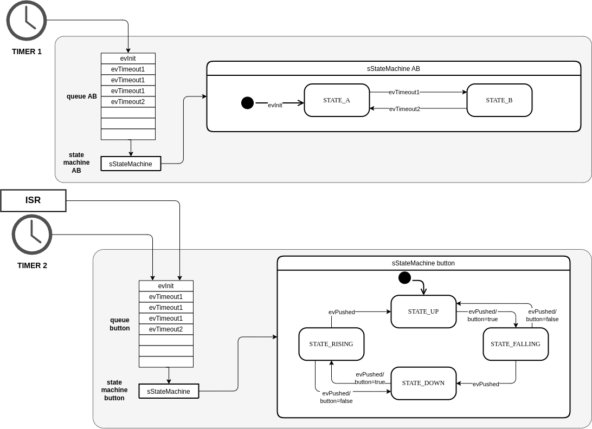
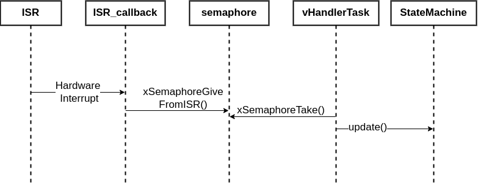
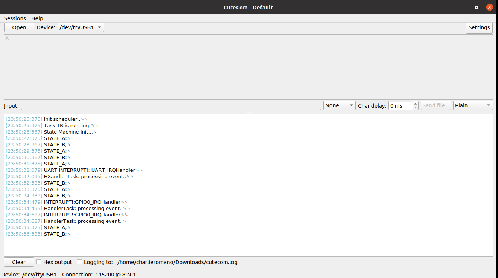

# State Machine and Active Object

[1. Ejemplos usando Objeto Activo con Interrupciones](#ActiveObjectISR))


## 1.  Ejemplo de Objetos Activos con máquinas de estado en RTOS <a name="activeObjectRTOS"></a>

**Ejemplo de máquina de estados usando un arreglo de estructuras **


En este ejemplo se implementan dos máquinas de estado: una sencilla que contiene solamente dos estados STATE_A y STATE_B y una segunda que maneja un LED, usando cuatro estados con intención de aplicar un algoritmo antirebote por software. La máquina de estados del LED, o statemachine_button, sólo se actualiza cuando el sistema sufre una interrupción de hardware debida al botón TEC1.


En este ejercicio se combinan dos máquinas de estado usando la misma estructura funcional y el patrón de objeto activo. La invocación de los eventos queda desacoplada de la ejecución, usando para esto las colas queue_1 y queue_2. 

La máquina de estados se detalla en el siguiente diagrama:





En este ejercicio se habilitan las interrupciones de la tecla TEC1 y se define un callback que lo único que hace es entregar o habilitar un semáforo binario, logrando que la rutina de interrupción sea lo más corta posible. Luego hay una tarea handler que toma el semáforo binario habilitado por la interrupción y ejecuta una rutina de actualización de una máquina de estados, usando el patrón de objeto activo. En el siguiente diagrama de secuencia se detalla la actividad que se realiza al recibir una interrupción por hardware.



El código usando freeRTOS en la EDU-CIAA se detalla a continuación:

```C
/* ISR.h */
#ifndef ISR_H
#define ISR_H

#include <stdio.h>
#include "FreeRTOS.h"   
#include "FreeRTOSConfig.h"
#include "semphr.h"		
#include "queue.h"      
#include "sapi.h"
#include "board.h"

extern SemaphoreHandle_t xBinarySemaphore;

void My_IRQ_Init (void);

#endif 


/*****************************************************************************
 * Copyright (c) 2022, Carlos Germán Carreño Romano <charlieromano@gmail.com>
 * All rights reserved.
 * License: gpl-3.0 (see LICENSE.txt)
 * Date: 2022/02/28
 * Version: 1.0
 ****************************************************************************/
#include 		 "ISR.h"

#define MY_ASSERT(CONDICION) my_assert_debug(CONDICION)
//Inicio IRQs
void My_IRQ_Init (void){

      //Inicializamos las interrupciones (LPCopen)
      Chip_PININT_Init(LPC_GPIO_PIN_INT);

      //Inicializamos cada evento de interrupcion (LPCopen)

      // TEC1 FALL
      Chip_SCU_GPIOIntPinSel(0, 0, 4);    //(Canal 0 a 7, Puerto GPIO, Pin GPIO)
      Chip_PININT_SetPinModeEdge(LPC_GPIO_PIN_INT, PININTCH0);//Se configura el canal para que se active por flanco
      Chip_PININT_EnableIntLow(LPC_GPIO_PIN_INT, PININTCH0);//Se configura para que el flanco sea el de bajada

      // TEC1 RISE
/*      Chip_SCU_GPIOIntPinSel(1, 0, 4); //(Canal 0 a 7, Puerto GPIO, Pin GPIO)
      Chip_PININT_SetPinModeEdge(LPC_GPIO_PIN_INT, PININTCH1);//Se configura el canal para que se active por flanco
      Chip_PININT_EnableIntHigh(LPC_GPIO_PIN_INT, PININTCH1);//En este caso el flanco es de subida
*/
      //Una vez que se han configurado los eventos para cada canal de interrupcion
      //Se activan las interrupciones para que comiencen a llamar al handler
      NVIC_SetPriority(PIN_INT0_IRQn, configLIBRARY_MAX_SYSCALL_INTERRUPT_PRIORITY);
      NVIC_EnableIRQ(PIN_INT0_IRQn);
/*    
      NVIC_SetPriority(PIN_INT1_IRQn, configLIBRARY_MAX_SYSCALL_INTERRUPT_PRIORITY);
      NVIC_EnableIRQ(PIN_INT1_IRQn);
*/

}


void GPIO0_IRQHandler(void){
   /* GPIO0_IRQHandler must be the name for LPC Interrupt routines for GPIO0*/

   /* Prevent another ISR or task with higher priority block this ISR*/
   BaseType_t xHigherPriorityTaskWoken = pdFALSE; 

   if (Chip_PININT_GetFallStates(LPC_GPIO_PIN_INT) & PININTCH0){ //Verificamos que la interrupción es la esperada
      Chip_PININT_ClearIntStatus(LPC_GPIO_PIN_INT, PININTCH0); //Borramos el flag de interrupción

      gpioWrite(LED2, ON);
      printf("INTERRUPT!:GPIO0_IRQHandler\r\n");
      xSemaphoreGiveFromISR(xBinarySemaphore, &xHigherPriorityTaskWoken);

   /* YIELD returns a valid value and will request a context switch. 
    * If xHigherPriorityTaskWoken is still pdFALSE 
    * then calling portYIELD_FROM_ISR() will have no effect.
    */
   }
   portYIELD_FROM_ISR( xHigherPriorityTaskWoken );
}


```
La segunda máquina de estados se presenta en el fragmento de código a continuación:

```c
#ifndef STATEMACHINE_AB_H
#define STATEMACHINE_AB_H

#include "sapi.h"
#include "board.h"
#include <stdio.h>

typedef enum {
	STATE_INIT_AB,
	STATE_A,
	STATE_B
} eSystemState_AB;

typedef enum{
	evInit_AB,
	evTimeout_A,
	evTimeout_B
} eSystemEvent_AB;

typedef eSystemState_AB (*pfEventHandler_AB)(void);

typedef struct{
	eSystemState_AB 		fsmState;
	eSystemEvent_AB 		fsmEvent;
	pfEventHandler_AB		fsmHandler;
} sStateMachine_AB;

eSystemState_AB 	InitHandler_AB(void);
eSystemState_AB 	AtoBHandler(void);
eSystemState_AB 	BtoAHandler(void);


#endif

//statemachine_AB.c
#include "statemachine_AB.h"

eSystemState_AB 	InitHandler_AB(void){ 
	printf("State Machine Init...\n");
	return STATE_A; 
}

eSystemState_AB 	AtoBHandler(void){
	printf("STATE_A;\n");
	return STATE_B; 
}
eSystemState_AB 	BtoAHandler(void){ 
	printf("STATE_B;\n");
	return STATE_A; 
}

sStateMachine_AB fsmMachineAB [] = 
{
	{STATE_INIT_AB, evInit_AB, InitHandler_AB},
	{STATE_A, evTimeout_A, AtoBHandler},
	{STATE_B, evTimeout_B, BtoAHandler}
};


#ifndef STATEMACHINE_AB_H
#define STATEMACHINE_AB_H

#include "sapi.h"
#include "board.h"
#include <stdio.h>

typedef enum {
	STATE_INIT_AB,
	STATE_A,
	STATE_B
} eSystemState_AB;

typedef enum{
	evInit_AB,
	evTimeout_A,
	evTimeout_B
} eSystemEvent_AB;

typedef eSystemState_AB (*pfEventHandler_AB)(void);

typedef struct{
	eSystemState_AB 		fsmState;
	eSystemEvent_AB 		fsmEvent;
	pfEventHandler_AB		fsmHandler;
} sStateMachine_AB;

eSystemState_AB 	InitHandler_AB(void);
eSystemState_AB 	AtoBHandler(void);
eSystemState_AB 	BtoAHandler(void);


#endif


//statemachine.c
#include "statemachine_button.h"

extern gpioMap_t button;

eSystemState_button 	pushingUpHandler(void)
{ 
	printf("STATE DOWN\n");
	gpioWrite(LEDG, OFF);
	gpioWrite(LEDB, ON);
	if(gpioRead(button)==true){
		printf("Button pressed:\n");
		return STATE_BUTTON_RISING;
	}
	else{
		return STATE_BUTTON_DOWN;		
	}
}

eSystemState_button 	pushingDownHandler(void)
{ 
	printf("STATE UP\n");
	gpioWrite(LEDB, OFF);
	gpioWrite(LEDG, ON);
	if(gpioRead(button)!=true){
		printf("Button pressed:\n");
		return STATE_BUTTON_FALLING;
	}
	else{
		return STATE_BUTTON_UP;		
	}
}

eSystemState_button 	bouncingUpHandler(void)
{ 
	if(gpioRead(button)==true){
		printf("Button pressed..\n");
		return STATE_BUTTON_UP;
	}
	else{
	//evBouncing
		return STATE_BUTTON_DOWN; 
	}
}

eSystemState_button 	bouncingDownHandler(void)
{ 
	if(gpioRead(button)==true){
		printf("Button pressed..\n");
		return STATE_BUTTON_UP;
	}
	else{
	//evBouncing
		return STATE_BUTTON_DOWN; 
	}
}


sStateMachine_button fsmButton [] = 
{
	{STATE_BUTTON_DOWN, evPushed, pushingUpHandler},
	{STATE_BUTTON_UP, evPushed, pushingDownHandler},
	{STATE_BUTTON_FALLING, evBouncing, bouncingDownHandler},
	{STATE_BUTTON_RISING, evBouncing, bouncingUpHandler}
};


```
Luego la ejecución del código principal resulta en una iteración muy sencilla que actualiza el estado de la máquina de estados según el evento de entrada y direccionando el handler que corresponda según el diseño. Con el patrón de objeto activo ahora la invocación se hace encolando y decolando mensajes.

```c
#ifndef TASKS_H
#define TASKS_H

#include "FreeRTOS.h"   
#include "FreeRTOSConfig.h"
#include "task.h"		
#include "semphr.h"		
#include "queue.h"
#include "timers.h"
#include "sapi.h"
#include "board.h"
#include "statemachine_button.h"
#include "statemachine_AB.h"

extern uint8_t data_button;
extern uint8_t data_AB;
extern sStateMachine_button 	fsmButton[]; /* State Machine struct */
extern sStateMachine_AB 		fsmMachineAB[]; /* State Machine struct */
extern xTaskHandle 	 	xTaskStateMachineHandler_button; /* RTOS task handler */
extern xTaskHandle 	 	xTaskStateMachineHandler_AB; /* RTOS task handler */
extern TimerHandle_t  	timerHandle_button; /* RTOS timer */
extern TimerHandle_t  	timerHandle_AB; /* RTOS timer */
extern QueueHandle_t 	queueHandle_button; /* RTOS queue */
extern QueueHandle_t 	queueHandle_AB; /* RTOS queue */
extern SemaphoreHandle_t xBinarySemaphore;

void vTaskTA(void *xTimerHandle);
void vTaskTB(void *xTimerHandle);
void vHandlerTask(void *pvParameters);

#endif

//tasks.c
#include "tasks.h"


void vTaskTA(void *xTimerHandle)
{
	(void)xTimerHandle;
	eSystemEvent_button newEvent;

	while(true){
		vPrintString("Task TA is running.\r\n");
		eSystemState_button nextState = STATE_BUTTON_DOWN;
		newEvent=evPushed;
		int i=0;

		while(true){
			xQueueReceive(queueHandle_button, &data_button, portMAX_DELAY);
			newEvent = data_button;
			fsmButton[nextState].fsmEvent == newEvent; //TO DO:data.event
			nextState = (*fsmButton[nextState].fsmHandler)();
			i++;
		}
		vPrintString("This task is running and about to delete itself.\r\n");
		vTaskDelete(xTaskStateMachineHandler_button);
	}
}


void vTaskTB(void *xTimerHandle)
{
	(void)xTimerHandle;
	eSystemEvent_AB newEvent;

	while(true){
		vPrintString("Task TB is running.\r\n");
		eSystemState_AB nextState = STATE_INIT_AB;
		newEvent=evInit_AB;
		int i=0;

		while(true){
			xQueueReceive(queueHandle_AB, &data_AB, portMAX_DELAY);
			newEvent = data_AB;
			fsmMachineAB[nextState].fsmEvent == newEvent; //TO DO:data.event
			nextState = (*fsmMachineAB[nextState].fsmHandler)();
			i++;
		}
		vPrintString("This task is running and about to delete itself.\r\n");
		vTaskDelete(xTaskStateMachineHandler_AB);
	}
}


void vHandlerTask(void *pvParameters){

   while(true){
      xSemaphoreTake(xBinarySemaphore, portMAX_DELAY);
      gpioWrite(LED2, OFF);
      printf("HandlerTask: processing event..\r\n");
   }
}

```

```c
#ifndef MAIN_H
#define MAIN_H

#include <stdio.h>
#include <stdint.h>
#include <stddef.h>
#include "FreeRTOS.h"   
#include "FreeRTOSConfig.h"
#include "task.h"		
#include "semphr.h"		
#include "queue.h"      
#include "sapi.h"
#include "board.h"
#include "tasks.h"
#include "timers.h"
#include "statemachine_AB.h"
#include "statemachine_button.h"
#include "ISR.h"
#include "udf.h"

#define  	QUEUE_MAX_LENGTH 	12

DEBUG_PRINT_ENABLE;

gpioMap_t button=TEC2;

uint8_t data_button  = 0; /* variable global */
uint8_t data_AB  = 0; /* variable global */

/* RTOS task handlers */
xTaskHandle 	xTaskStateMachineHandler_button; 
xTaskHandle 	xTaskStateMachineHandler_AB; 

/* State Machine Button*/
TimerHandle_t  	timerHandle_button; /* RTOS timer */
QueueHandle_t 	queueHandle_button; /* RTOS queue */
void timerCallback_button(TimerHandle_t xTimerHandle); /* RTOS timer */

/* State Machine AB*/
TimerHandle_t  	timerHandle_AB; /* RTOS timer */
QueueHandle_t 	queueHandle_AB; /* RTOS queue */
void timerCallback_AB(TimerHandle_t xTimerHandle);/* RTOS timer */


SemaphoreHandle_t xBinarySemaphore;

#endif 

/*****************************************************************************
 * Copyright (c) 2022, Carlos Germán Carreño Romano <charlieromano@gmail.com>
 * All rights reserved.
 * License: gpl-3.0 (see LICENSE.txt)
 * Date: 2022/02/28
 * Version: 1.0
 ****************************************************************************/

#include "main.h"

int main(void)
{

   boardConfig();
   debugPrintConfigUart( UART_USB, 115200 );
   My_IRQ_Init();

   /* Create the task */
   if( xTaskCreate( vTaskTA, "State Machine using active object", 
      configMINIMAL_STACK_SIZE*2, NULL, tskIDLE_PRIORITY+1, 
      &xTaskStateMachineHandler_AB) == pdFAIL ) {
      perror("Error creating task");
      return 1;
   }

   /* Create the task */
   if( xTaskCreate( vTaskTB, "State Machine using active object", 
      configMINIMAL_STACK_SIZE*2, NULL, tskIDLE_PRIORITY+1, 
      &xTaskStateMachineHandler_button) == pdFAIL ) {
      perror("Error creating task");
      return 1;
   }

   /* Create the task */

   if( xTaskCreate( vHandlerTask, "ISR Handler task", 
      configMINIMAL_STACK_SIZE*2, NULL, tskIDLE_PRIORITY+1, 
      NULL) == pdFAIL ) {
      perror("Error creating task");
      return 1;
   }

   /* Create the queue*/
   queueHandle_button = xQueueCreate(QUEUE_MAX_LENGTH, sizeof(eSystemEvent_button));
   queueHandle_AB = xQueueCreate(QUEUE_MAX_LENGTH, sizeof(eSystemEvent_AB));

   /* Create the timer */
   if( (timerHandle_button = xTimerCreate( "Timer1", 500, true, NULL, 
      timerCallback_button)) == NULL ) {
      perror("Error creating timer");
      return 1;
   }
   
   if( (timerHandle_AB = xTimerCreate( "Timer2", 2000, true, NULL, 
      timerCallback_AB)) == NULL ) {
      perror("Error creating timer");
      return 1;
   }

   xBinarySemaphore = xSemaphoreCreateBinary();
   if (xBinarySemaphore == NULL){
      perror("Error creating semaphore");
      return 1;
   }

   /* Start the timer */
   xTimerStart(timerHandle_button, 0);
   xTimerStart(timerHandle_AB, 0);


   /* Start RTOS */
printf("FLAG  OK/NO OK\r\n");
   vTaskStartScheduler();   // Scheduler

   while(true);

   return 0;
}

void timerCallback_button(TimerHandle_t xTimerHandle){

   eSystemEvent_button data_button = evPushed;
   xQueueSend(queueHandle_button, &data_button, 0U);
}

void timerCallback_AB(TimerHandle_t xTimerHandle){
   static uint8_t cnt = 0;
   cnt++;

   eSystemEvent_AB data_AB = cnt%4;
   xQueueSend(queueHandle_AB, &data_AB, 0U);
}


```

La ejecución de cada máquina está limitada a un número finito de  iteraciones. Al finalizar los objetos activos (tareas de freeRTOS) se destruyen. Notar que al iniciar el scheduler arranca la tarea TaskTB primero por orden de prioriddad. Se observa que la task que actualiza la máquina de estados AB se ejecuta hasta ser interrumpida por la ISR del botón TEC1. El callback (GPIO0_IRQHandler) entrega un semáforo binario que es tomado por la tarea handler (vTaskHandler) que actualiza la máquina de estados del botòn. En la siguiente figura se puede ver la ejecución. 



Se puede observar que luego de la primer eliminación de tareas (objeto activo 1), sólo queda en ejecución la máquina de estados B, hasta finalizar y ser eliminada también.

Este ejemplo está inspirado en el siguiente artículo online:

[2] Ref: https://www.sinelabore.de/doku.php/wiki/howto/rtos

