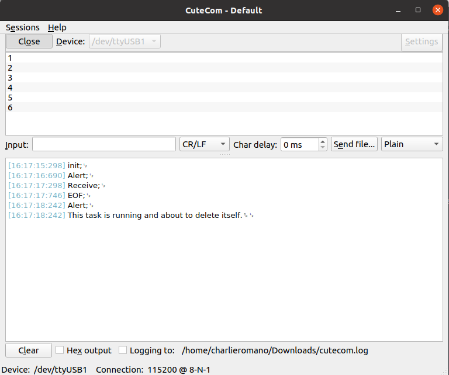

# RTOS_fsm


[1. Finite State Machine (fsm)](#fsm)
[2. Finite State Machine con RTOS](#fsmRTOS)


## 1. Finite State Machine (fsm) <a name="fsm"></a>

**Ejemplo de máquina de estados usando un arreglo de estructuras [1]**

[1] Ref: https://aticleworld.com/state-machine-using-c/, consultado durante Enero 2022.


En este ejemplo se implementa una máquina de estados sencilla que contiene tres estados. El ejemplo está implementado en C y se puede compilar directamente en el sistema operativo. Tiene como fin introducir conceptualmente la estrategia de máquina de estados con arreglo de estructuras (array of structure).

La máquina de estados se detalla en el siguiente diagrama: a la izquierda su estructura y a la derecha su funcionamiento.


Las definiciones de estados, eventos, estructura y handlers se muestra en el código a continuación. Observar que con esta estructura simple y transparente al diseño se logra escala, legibilidad y mantenibilidad. El uso o cambio de  handlers queda explícito por fuera del funcionamiento de la máquina de estados. Este tipo de implementación requiere el diseño previo de la máquina, especificando como se puede ver en el diagrama todo el funcionamiento de la máquina, incluyendo estados y eventos.

```C
// fsm definitions

// Estados
typedef enum {
	STATE_INIT,
	STATE_A,
	STATE_B,
	STATE_C
} eSystemState;

//Eventos
typedef enum{
	evInit,
	evAlert,
	evReceive,
	evEOF
} eSystemEvent;

typedef eSystemState (*pfEventHandler)(void); //puntero a funcion

// State Machine struct
typedef struct{
	eSystemState 		fsmState;
	eSystemEvent 		fsmEvent;
	pfEventHandler 		fsmHandler;
} sStateMachine;

// Handlers
eSystemState 	InitHandler(void)	{ printf("init;\n");return STATE_A; }
eSystemState 	AlertHandler(void)	{ printf("Alert;\n");return STATE_B; }
eSystemState 	ReceiveHandler(void){ printf("Receive;\n");return STATE_C; }
eSystemState 	EOFHandler(void) 	{ printf("EOF;\n");return STATE_A; }

// State Machine Design
sStateMachine fsmTest [] = 
{
	{STATE_INIT, evInit, InitHandler},
	{STATE_A, evAlert, AlertHandler},
	{STATE_B, evReceive, ReceiveHandler},
	{STATE_C, evEOF, EOFHandler}
};

```

Luego la ejecución del código principal resulta en una iteración muy sencilla que actualiza el estado de la máquina de estados según el evento de entrada y direccionando el handler que corresponda según el diseño. En este caso de estudio hay una sola salida por cada estado posible.

```c
// fsmTest.c
#include 	<stdio.h>

// ... fsm definitions ... 

int main (int argc, char *argv[])
{
	int i=0;
	eSystemState nextState = STATE_INIT;
	eSystemEvent newEvent;
	int c;

	while(i<10) //solo para finalizar el ejemplo
	{

		if((c = getchar()) != '\n' && (c = getchar()) != '\r' )
		{
			newEvent++;
			fsmTest[nextState].fsmEvent == newEvent;
			nextState = (*fsmTest[nextState].fsmHandler)();
			i++;
		}
		else
		{
			printf("no condition\n;");
		}
	
	}

	return 0;
}
```

En la siguiente figura se muestra la compilación y ejecución de este ejemplo. Se puede ver que las primeras dos ejecuciones muestran "no condition", dado que se presionó enter ("\n") dos veces seguidas, cayendo el programa fuera de la condición de actualización de la máquina de estados. Luego se ingresó 1, 2, ... y así hasta finalizar los 10 pasos del ciclo while() especificado. Observar que en cada iteración el handler va cambiando y sólo imprime un mensaje y actualiza el estado de la máquina.


## 2. Finite State Machine con RTOS <a name="fsmRTOS"></a>

https://www.sinelabore.de/doku.php/wiki/howto/rtos


