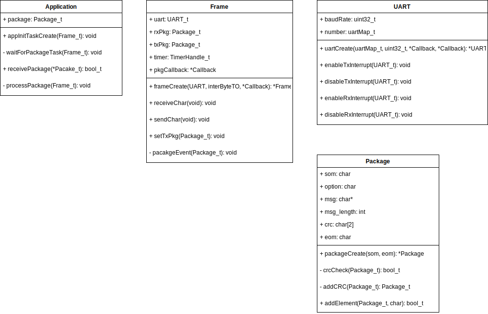
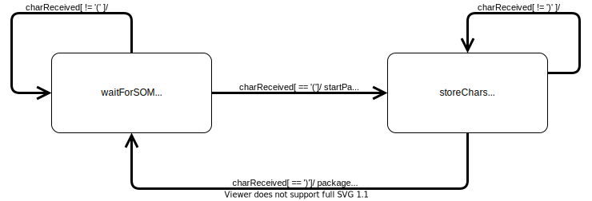
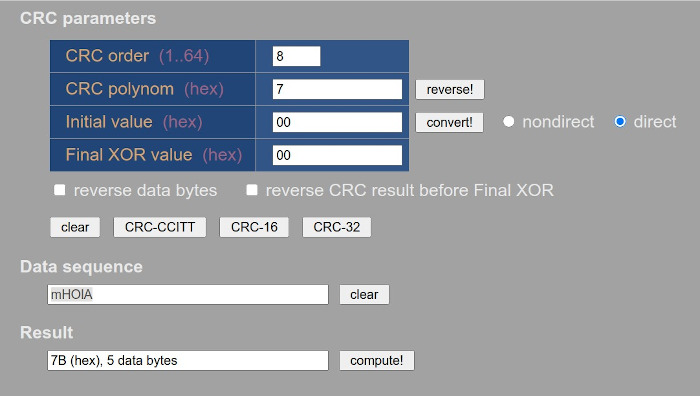

# Trabajo final de la materia sistemas operativos en tiempo real II

Alumnos:
* Carlos Germán Carreño Romano
* David Broin
* Luciano Vittori

## Documento de arquitectura y diseño detallado de software

**Índice de contenido**

[TOC]

# Introducción

## Propósito

  Este documento contiene la arquitectura de software y el diseño detallado del firmware del “trabajo final de la materia sistemas operativos en tiempo real II”. Está dirigido a desarrolladores que se ocupen del análisis, diseño e implementación, así como también a quienes desarrollen el testing del software.

## Ámbito del Sistema

  Este firmware llevará el nombre de TP-RTOS-II (Trabajo práctico Real Time Operating System 2).
  El objetivo de esta práctica es aprender a trabajar con algoritmos de asignación de memoria en un contexto de ejecución de tiempo real. Estos algoritmos están orientados a tener un tiempo de ejecución corto y determinista.
  Se pretende hacer uso de un asignador de memoria existente.
  Por último se busca aprender a trabajar con procesamiento asincrónico de eventos.

## Definiciones, Acrónimos y Abreviaturas

* uC - Microcontrolador.
* TIMER - Temporizador.
* UART - Universal Asynchronous Receiver-Transmitter.
* GPIO - General Purpose Input/Output.
* SOM - Start Of Message.
* EOM - End Of Message.
* CRC - Cyclic redundancy check.
* DEBUG - Depuración de errores.
* N/A - No aplica.
* TBC - A ser confirmado (to be confirmed).
* TBD - A ser definido (to be defined).

## Referencias

* [RTOS 2 - Clase 2 - Trabajo Practico](https://github.com/Luchao90/TP_RTOS_II/blob/master/docs/RTOS%202%20-%20Clase%202%20-%20Trabajo%20Practico.pdf) Especificación de requerimientos del firmware del “Trabajo práctico de la materia sistemas operativos en tiempo real II”.
* [Archivo excel](https://docs.google.com/spreadsheets/d/16--Bt-0-mT4Q3hkVkFdtkYlLrggH5fLkRMGU1ALApkY/edit#gid=395311875) comentarios sobre requerimientos y fechas de entrega.
* [RTOS 2 - Clase 2 - Explicación del TP.pdf](https://github.com/Luchao90/TP_RTOS_II/blob/master/docs/RTOS%202%20-%20Clase%202%20-%20Explicaci%C3%B3n%20del%20TP.pdf)

## Visión General del Documento

1. Este documento incluye al inicio una definición del tipo de arquitectura utilizado.
2. Posteriormente se incluyen los componentes de software, sus responsabilidades e interfaces.
3. Por último se incluye el diseño detallado de cada componente de software.

# Arquitectura

## Patrones

Para este firmware se emplearán los siguientes patrones arquitectónicos.

1. Arquitectura en capas.
2. Capa de abstracción de hardware (HAL).

### Patrón arquitectura en capas.

  Se utilizará este patrón para tener separados los componentes del firmware en distintos niveles de abstracción. Esto nos permitirá de forma más ordenada agregar funcionalidades progresivamente teniendo definido desde un principio en que orden se dará la comunicación entre las partes. También se facilitará el mantenimiento y la evolución del firmware en futuras versiones.

  Las capas serán las siguientes:

1. Capa de aplicación.
2. Capa de sistema operativo.
3. Capa de abstracción de hardware.

### Patrón capa de abstracción de hardware (HAL)

  Debido a que se utilizará la placa de desarrollo edu_ciaa_nxp, se utilizará como capa de abstracción del hardware principalmente la sAPI del [firmware_V3](https://github.com/epernia/firmware_v3) y su [entorno](https://github.com/epernia/software/) de programación del proyecto [CIAA](http://www.proyecto-ciaa.com.ar/devwiki/doku.php?id=desarrollo:edu-ciaa:edu-ciaa-nxp).

### Patrón de asignación de memoria

Debido a que tendremos tamaños variables como entrada a nuestra sistema, implementaremos asginación de memoria dinámica para almacenar los datos a procesar a medida que sea necesario. Se utilizará un patrón de asignación de memoria dinámica manual. Esto nos permitirá tener el control de la memoria que se pide y libera en el sistema para cumplir con un compartamiento determinista. A modo de lograr que el tiempo de asignación y liberación de memoria en los procesos sea el mas corto posible, se elige utilizar un algoritmo de alocación de memoria **memory pools**.

## Componentes

Cada capa de software es considerada un componente de software. Con lo cual se poseen los siguientes componentes:

1. HAL.
2. Sistema Operativo - FreeRTOS
3. Aplicación

A su vez, la capa de aplicación estará compuesta por los siguientes componentes de software:

* C3 Interpretación
    * Validación de paquete
    * Procesamiento de paquete (según comando de control).
      * Respuesta.
    
* C2 frame driver
    * Objeto package
		- Memory Pool.
		- Integridad de paquete (CRC).
		- Empaquetamiento.(Para agregar delimitadores y CRC a un string nuevo).

    * Objeto Uart
    * Separación de paquetes.

    
## Interfaces

### Interfaces Externas 

* Leds
    * Led de alimentación microcontrolador.
    * Led de error.
    * Led de funcionamiento (periódico).
    * Led de actividad en comunicación.
* Chip de comunicación USB.

### Interfaces Internas 

* Periférico UART del uC para conexión con el chip USB.
* TIMER del OS.
* Periférico TIMER del uC para timeout en caso de utilizar tiempos muy chicos.
* Periférico GPIO del uC para señales digitales.
    * Salida de LEDs de estado.

# Diseño detallado

Se trabajaran con tramas de datos en codificación ASCII que tendrán el siguiente formato:

**SOM - C - DATOS - CRC - EOM**

* SOM: Caracter '('
* EOM: Caracter ')'
* C: Caracter alfabético, en primera instancia solo podrán ser los caracteres 'm' y 'M'.
* CRC: 2 caracteres alfanuméricos correspondientes el valor en hexadecimal del resultado del algoritmo CRC8.
* DATOS: de largo N.
    * N irá entre 1 a un valor máximo que prefijaremos en 100.

    
## C2 Frame Driver

### Objeto Package
* som: caracter de inicio de paquete.
* C: caracter de opcion.
* message: cadena de caracteres correspondientes a los datos.
* message_length: cantidad de caracteres del mensaje.
* crc: 2 caracteres correspondientes al CRC del mensaje.
* eom: caracter de fin de paquete.
* package_ctor(som, eom): Crea el objeto e inicializa los delimitadores que se utilizarán para som y eom.
* package_ctor(): Destruye el objeto.
* package_addElement(element): Agrega un elemento al paquete. Esta función manejará memoria dinámica.
* package_check(): No se agregaran mas elementos, cierra el paquete y chequea el CRC que sea valido.
* package_calc(): Calcula el CRC correcto para el contenido actual del paquete.

#### Memory Pool.
Se utilizará el algoritmo de [QMPool](https://www.state-machine.com/qpc/qmpool_8h.html) para ir almacenando el campo de datos. Este componente solo recibirá peticiones de alocación de memoria y devolverá los punteros para trabajar o NULL en caso de no haber mas memoria disponible.
La comunicacin entre C2 y C3 se hará mediante colas, pero pasando el puntero y el tamaño de los bloques asignados a cada trama. 
La idea será no copiar los datos entre capas para ser eficientes en el uso de la memoria y los tiempos.

### Objeto UART
* number: numero de uart de hardware.
* baudrate: velocidad de comunicación.
* UartCreate(): inicializa el objeto instanciado. Configurará la uart que utilizará y recibirá las funciones de callback para las interrupciones de RX y TX.
* enableTxInterrupt(): Habilita interrupcion de transmisión.
* disableTxInterrupt(): Deshabilita interrupcion de transmisión.
* enableRxInterrupt(): Habilita interrupcion de recepción.
* disableRxInterrupt(): Deshabilita interrupcion de recepción.

### Frame Driver:
* uart: instancia de UART.
* rxPkg: instancia de Package para recepción.
* txPkg: instancia de Package para transmisión.
* timer: instancia de timer de freeRTOS.
* pkgCallback: funcion para callback de paquete listo para procesar o procesado.
* frameCreate(): inicializar objeto.
* receiveChar(): Callback para interrupción de byte recibido.
	    * verifica SOM.
	    * activa TIMER una vez que lo recibió y va pidiendo memoria en función del mensaje.
	    * Resetea TIMER en cada byte recibido.
	    * callback timer: descarta después de 50 ms para tramas inconclusas.
	    * Descarta trama para CRC inválido.
* sendChar(): Callback para interrupción de byte transmitido.
* setTxPkg(): Función para setear paquete a enviar.
* crcCheck(): Función para chequear CRC de paquete.
* addCRC(): Función para agregar CRC a paquete a ser enviado.
* packageEvent(): generar evento de paquete recibido.

### Chequeo de integridad de paquete (CRC).
* crcCheck(): Recibe trama con los campos SOM-C-DATOS-CRC-EOM y verifica el CRC. Devuelve True o False según la trama.
* addCRC(): Recibe una trama con los campos SOM-C-DATOS-CRC-EOM y agrega el CRC Válido.

Para pruebas se utilizará el siguiente [calculador online](http://www.zorc.breitbandkatze.de/crc.html)

## C3 Interpretación

### Validación de paquete
* package: contiene un paquete.
* appInitTaskCreate():
* receivePackage(): Tarea qeu espera un paquete.
* receivePackage(): recibe el bloque de memoria y largo de un paquete desde C2, procesa los datos y responde: "OK" para indicar que el campo dato ya esta procesado, "ERROR1" para indicar que en el campo datos habia caracteres no alfabéticos o "ERROR2" si en el campo C no había un comando válido.

### Procesamiento de paquete (según comando de control).
* processPackage(): Funcion para procesar el campo DATOS de package.
    * m: cambia todos los caracteres en mayúscula a minúscula.
    * M: cambia todos los caracteres en minúscula a mayúsucula.
